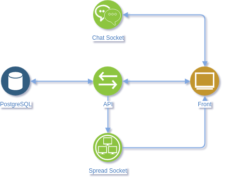

# Potential Enigma

Ce projet est l'agrégation de deux autres :

- Projet back : [potential-enigma-ws-api](https://github.com/sylvainDNS/potential-enigma-ws-api)
- Projet front : [potential-enigma-front](https://github.com/sylvainDNS/potential-enigma-front)

J'utilise des `git submodules` pour permettre la gestion des différentes sources.

## Prérequis

- Système d'exploitation UNIX (utilisation de `Makefile`)
- Docker > 18.0.0
- docker-compose
- Node.js LTS Dubnium (> 10.13.0)
- Yarn
- Un navigateur _evergreen_

## Installation

`Makefile` est utilisé pour installer tous les projets. À l'origine utilisé pour compiler des programmes en _C_, il permet d'automatiser des tâches.

Pour connaître les commandes disponnibles, exécutez :

```sh
make
```

## Sous-projets

L'architecture générale de l'application se compose ainsi :



Les deux projets utilisent les linters _ESlint_ et _Prettier_ pour veiller à la propreté du code.

### potential-enigma-ws-api

##### BDD

La base de données utilisée est PostgreSQL, exécutée dans un container docker.
Le schéma de la base est créé au moment du lancement de l'image docker :

| Key | Column name | Type      |
| --- | ----------- | --------- |
| PK  | game_id     | uuid      |
|     | createdAt   | timestamp |
|     | deletedAt   | timestamp |
|     | completedAt | timestamp |

Toutes les dates sont gérées par la bdd. Lors d'une suppression, je ne supprime pas la ligne mais renseigne la date de suppression.

##### API / WS

Pour le back, j'utilise _Babel_ pour rendre interprétable le JavaScript par _Node.js_, qui ne permet pas de tout interpréter nativement. _WebPack_ est utilisé comme bundler pour le js.

Le back se compose d'une API permettant d'intéragir avec les données, et de 2 WebSockets :

- un pour transmettre les parties de babyfoot à actualiser (`/spread`)
- un pour transmettre les messages du chat, non conservés en base (`/chat`)

L'API est documentée à l'aide d'un _Swagger_ accessible sur la route `/documentation`.

Lors d'une modification (ajouter, modifier, supprimer, terminer) d'une partie via l'API, l'événement associé à la modification et le `game_id` de la partie est transmis par WebSocket à tous les clients pour répercuter les changements.

Le WebSocket chat transmet les messages à tous les clients sauf à l'expéditeur.

J'utilise [hapi](https://hapijs.com/) comme serveur HTTP me permettant de propulser mon API et mes WebSockets.

J'utilise Socket.io comme gestionnaire de WebSocket.

### potential-enigma-front

Pour le front, j'utilise _Babel_ pour rendre interprétable le JavaScript par le navigateur. _WebPack_ est utilisé comme bundler pour le js, scss, les images et pour propulser le html.

Le fichier `index.html` est relativement vide, tout le html est généré et injecté à l'aide du JS.

J'ai utilisé une approche par composant pour construire les différents éléments qui composent le front.

J'utilise [Bootstrap](https://getbootstrap.com/) comme framework CSS.
